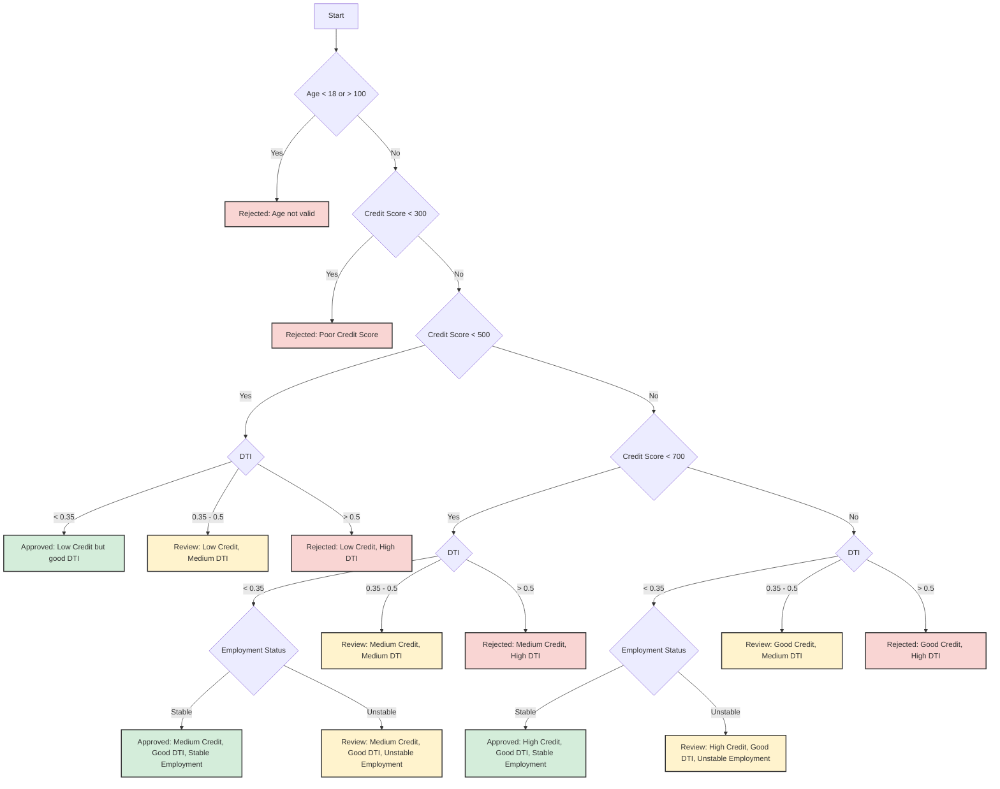

# Loan Assessment Flowchart

```mermaid
graph TD
    A[Start] --> B{Age < 18 or > 100}
    B -- Yes --> C[Rejected: Age not valid]
    B -- No --> D{Credit Score < 300}
    D -- Yes --> E[Rejected: Poor Credit Score]
    D -- No --> F{Credit Score < 500}
    F -- Yes --> G{DTI}
    F -- No --> H{Credit Score < 700}
    G -- < 0.35 --> I[Approved: Low Credit but good DTI]
    G -- 0.35 - 0.5 --> J[Review: Low Credit, Medium DTI]
    G -- > 0.5 --> K[Rejected: Low Credit, High DTI]
    H -- Yes --> L{DTI}
    H -- No --> M{DTI}
    L -- < 0.35 --> N{Employment Status}
    L -- 0.35 - 0.5 --> O[Review: Medium Credit, Medium DTI]
    L -- > 0.5 --> P[Rejected: Medium Credit, High DTI]
    M -- < 0.35 --> Q{Employment Status}
    M -- 0.35 - 0.5 --> R[Review: Good Credit, Medium DTI]
    M -- > 0.5 --> S[Rejected: Good Credit, High DTI]
    N -- Stable --> T[Approved: Medium Credit, Good DTI, Stable Employment]
    N -- Unstable --> U[Review: Medium Credit, Good DTI, Unstable Employment]
    Q -- Stable --> V[Approved: High Credit, Good DTI, Stable Employment]
    Q -- Unstable --> W[Review: High Credit, Good DTI, Unstable Employment]

    classDef red fill:#f9d5d3,stroke:#333,stroke-width:2px;
    classDef green fill:#d4edda,stroke:#333,stroke-width:2px;
    classDef yellow fill:#fff3cd,stroke:#333,stroke-width:2px;
    class C,E,K,P,S red;
    class T,V,I green;
    class J,O,R,U,W yellow;
```
