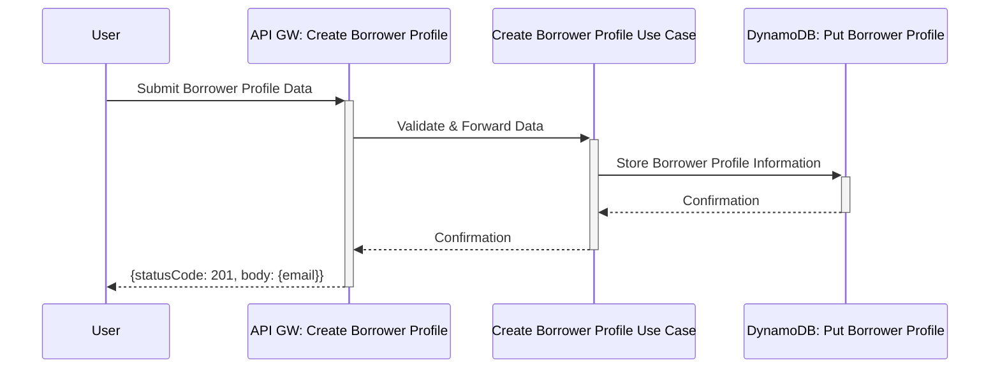
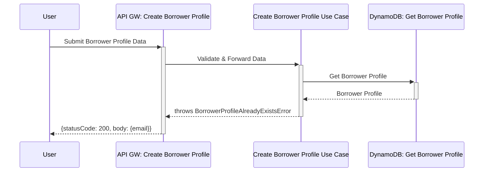
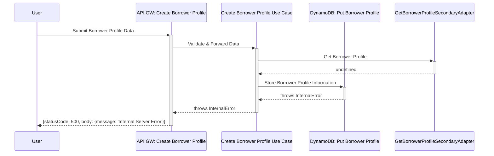
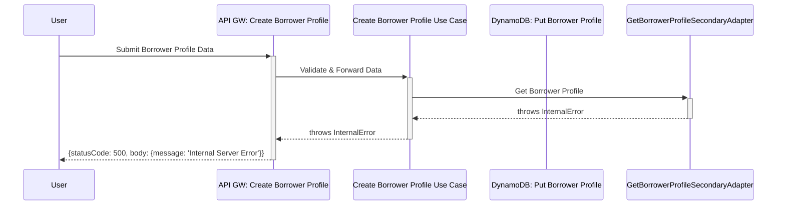

# Borrower Profile

## Creating a Borrower Profile

1. A user submits their details to create a borrower profile via the client application.
2. This request is captured by the `api-gw-create-borrower-profile` primary adaptor.
3. The `api-gw-create-borrower-profile` primary adaptor sends the profile details to the `create-borrower-profile` use case in the domain layer.
4. The the `create-borrower-profile` use case validates and processes the details, then employs the `ddb-put-borrower-profile` secondary adapter to store the profile in DynamoDB.
5. A confirmation of profile creation is sent back to the user through the primary adaptor.

## Scenarios

### New Borrower Profile Created (201)

### Borrower Profile Already Exists (200)

A borrower with the same email address was previously created.   

   

### Borrower Profile Could Not Be Created (500)

There are various potential causes for this:

- DynamoDB Service Outage
- Lambda Service Outage
- Insufficient Permissions (Create Borrower Profile Use Case) 

### Borrower Profile Could Not Be Retrieved (500)

There are various potential causes for this:

- DynamoDB Service Outage
- Lambda Service Outage
- Insufficient Permissions (Create Borrower Profile Use Case) 

import { OutgoingMessage } from "http"
