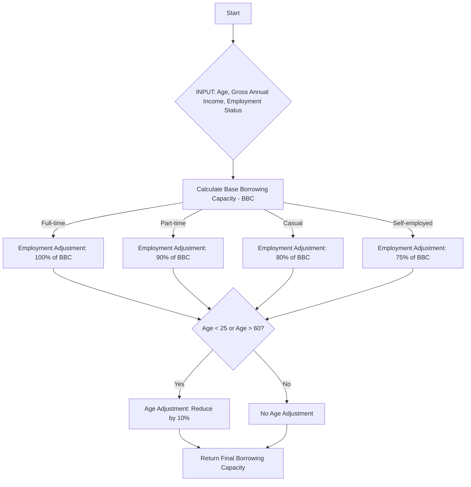
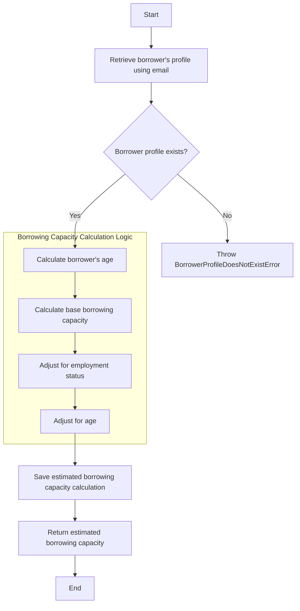
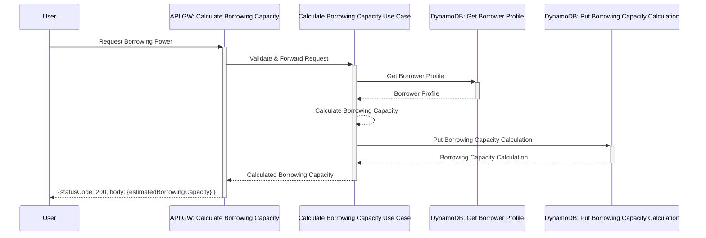
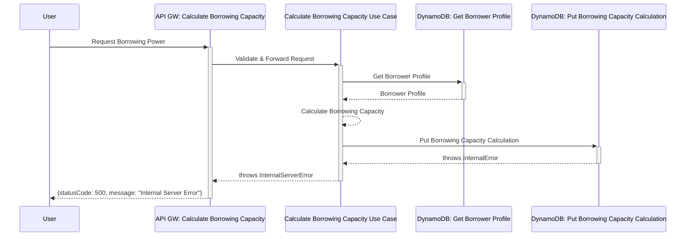
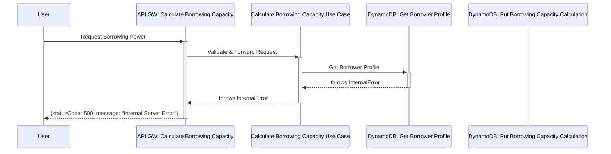
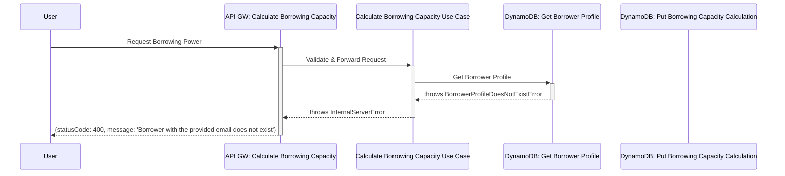

# Borrowing Capacity

## Calculating Borrowing Capacity

1. User requests a borrowing capacity calculation through the client application.
2. The request hits the primary adaptor: `api-gw-calculate-borrowing-power`.
3. The primary adaptor passes the request to the `calculate-borrowing-capacity` use case in the domain layer.
4. The `calculate-borrowing-capacity` use case interacts with the `ddb-get-borrower-profile` secondary adapter to retrieve borrower profile from DynamoDB.
5. The `calculate-borrowing-capacity` use case calculates the borrowing capacity and uses a secondary adaptor `ddb-put-borrowing-capacity-calculation` to persist the borrowing capacity calculation to DynamoDB.
6. The estimated borrowing capacity is returned to the user through the primary adaptor.

## How Is Borrowing Capacity Calculated?

Borrowing capacity is calculated in three steps:

1. Calculate the borrower's _Base Borrowing Capacity (BBC)_
2. Adjust BBC according to Employment Status
3. Adjust the Employment Adjusted Borrowing Capacity based on borrower's age
4. Return the final _Borrowing Capacity_

## `calculate-borrowing-capacity` Use Case

## Scenarios

### Borrowing Capacity Calculated (200)

### Borrowing Capacity Calculation Could Not Be Created (500)

There are various potential causes for this:

- DynamoDB Service Outage
- Lambda Service Outage
- Insufficient Permissions (Calculate Borrowing Capacity Use Case) 

### Borrower Profile Could Not Be Retrieved (500)

There are various potential causes for this:

- DynamoDB Service Outage
- Lambda Service Outage
- Insufficient Permissions (Calculate Borrowing Capacity Use Case) 

### Borrower Does Not Exist (400)

