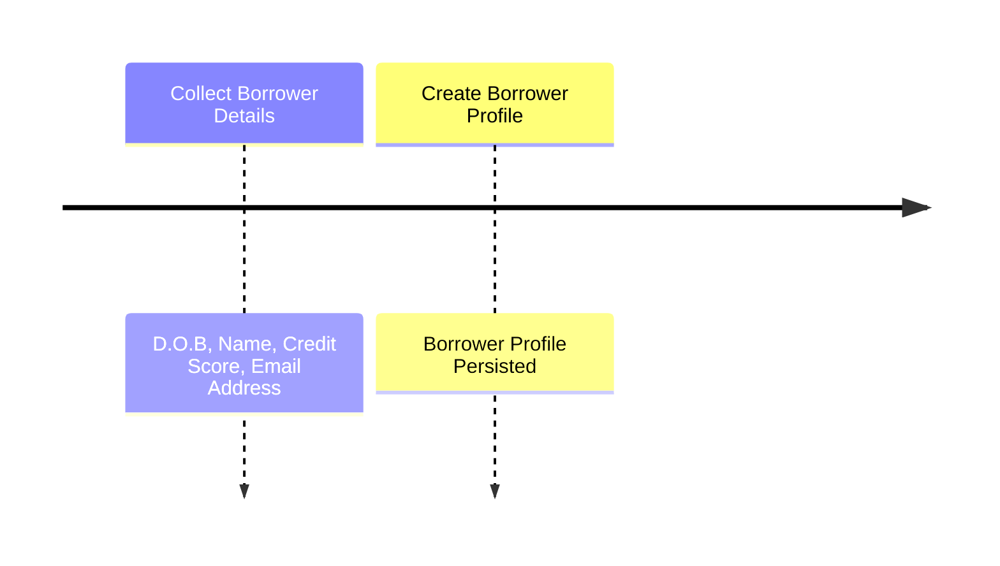
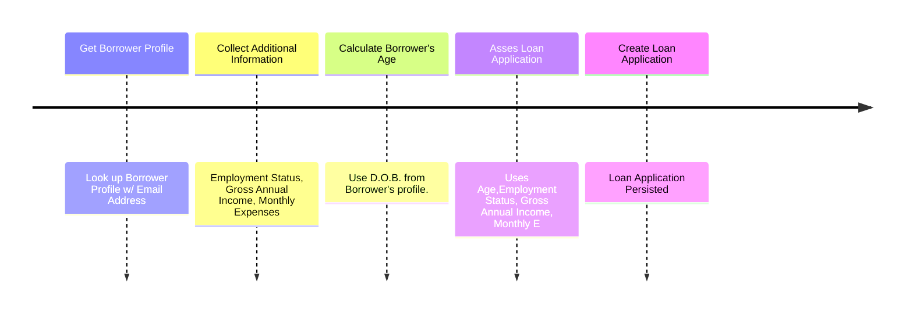
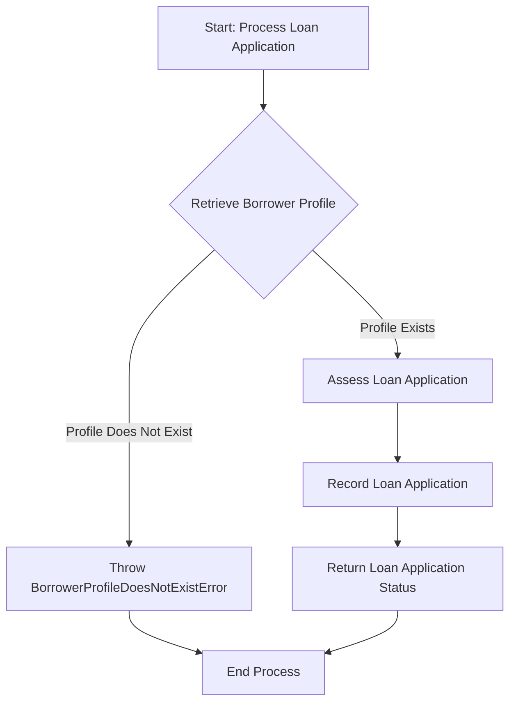
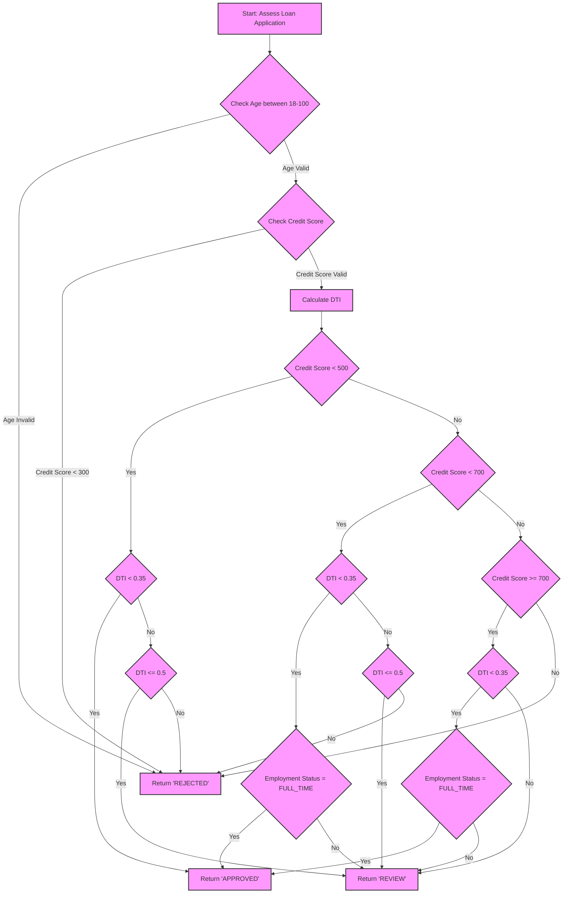
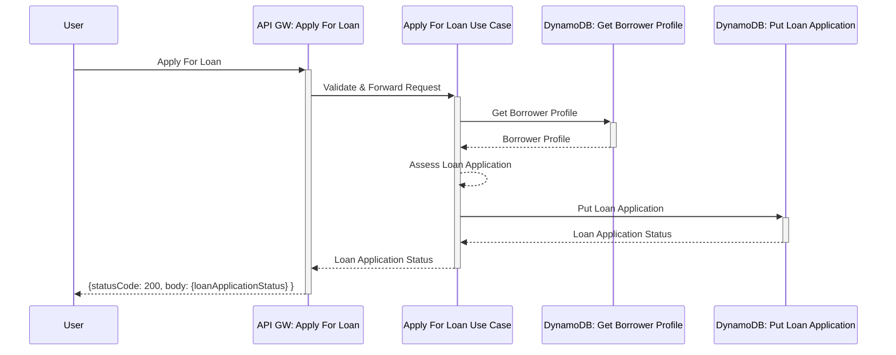
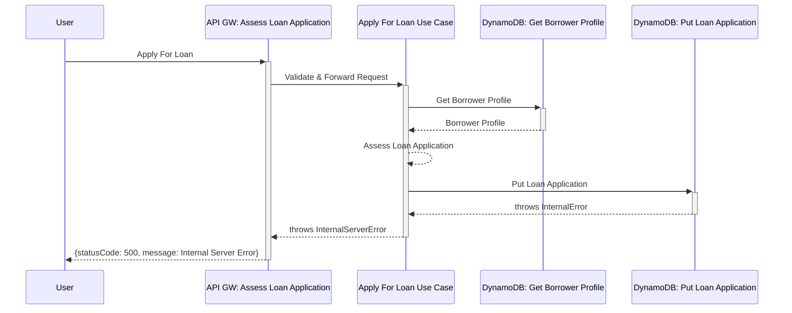
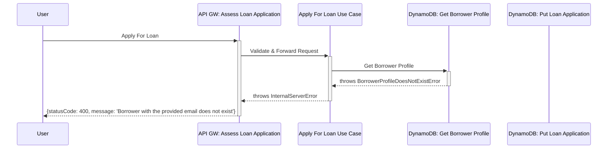

# Overview

## Stories

## Create a profile

## Apply for a loan

1. User initiates a request to apply for a loan through a client application.
2. The request is received by the primary adaptor: `api-gw-apply-for-loan`.
3. The primary adaptor validates the request and forwards it to the `process-loan-application` use case in the domain layer.
4. The `process-loan-application` use case interacts with the `ddb-get-borrower-profile` secondary adapter to retrieve borrower details from DynamoDB.
5. The `process-loan-application` use case processes the application and uses a secondary adaptor `ddb-put-loan-application` to persist the loan application to DynamoDB.
6. The loan application application status is returned to the user through the primary adaptor.

## `process-loan-application` Use Case

### Assess Loan Application

## Scenarios

### Loan Application Completed (201)

### Loan Application Could Not Be Created (500)

### Borrower Does Not Exist (400)

