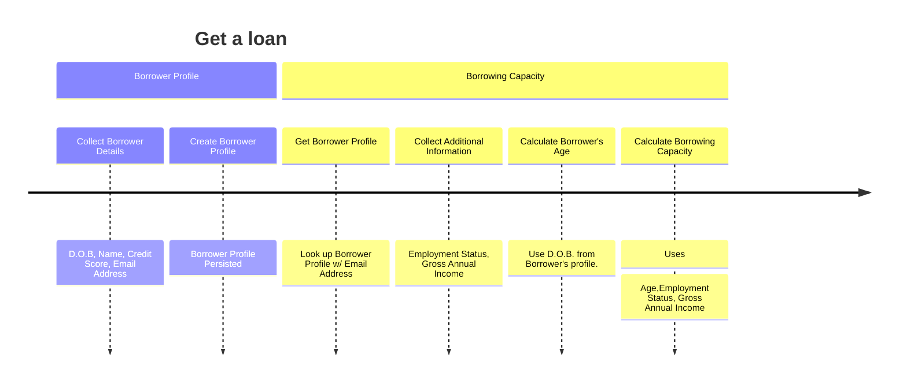

# Stories

```mermaid
timeline
    title Get a loan
    section Borrower Profile
        Collect Borrower Details : D.O.B, Name, Credit Score, Email Address
        Create Borrower Profile : Borrower Profile Persisted
    section Borrowing Capacity
        Get Borrower Profile : Look up Borrower Profile w/ Email Address
        Collect Additional Information: Employment Status, Gross Annual Income   
        Calculate Borrower's Age: Use D.O.B. from Borrower's profile.
        Calculate Borrowing Capacity: Uses:  Age,Employment Status, Gross Annual Income
```